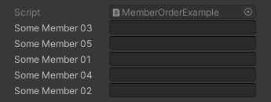

# MemberOrder

### Requires [Odin Inspector](https://odininspector.com/)

### Examples
Examples can be found in the downloaded files.

```CSharp
using UnityEngine;

[MemberOrder(@"
0 = someMember03
1 = someMember05
@someMember01Order = someMember01
3 = @someMember04Name
4 = @GetMember02Name()
")]
public class MemberOrderExample : MonoBehaviour
{
    public string someMember01;
    public string someMember02;
    public string someMember03;
    public string someMember04;
    public string someMember05;

    private float someMember01Order = 2f;
    private string someMember04Name = "someMember04";

    private string GetMember02Name()
    {
        return "someMember02";
    }
}
```



### Usage
Simply put the downloaded MemberOrder folder in your project
and start using the attribute as in the example file.
You can move the files, but make sure that `MemberOrderAttribute.cs`
is not in an editor folder or it will be removed during build, causing errors.

Both the order and the member name can be provided via [ValueResolvers](https://odininspector.com/documentation/sirenix.odininspector.editor.valueresolvers.valueresolver-1)
